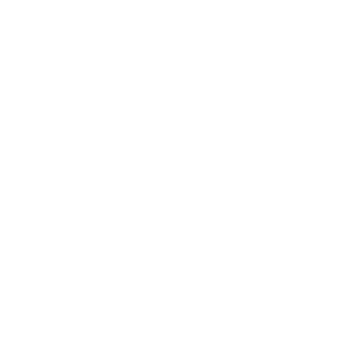

<div align="center">
  
  <h1>Mugen</h1>
  <p><strong>A personal Aniyomi fork for anime, manga, and novels (ranobe).</strong></p>
  <p>
    <a href="https://github.com/h80r/mugen/releases"></a>
    <a href="LICENSE"></a>
    <a href="https://developer.android.com/about/versions/oreo"></a>
  </p>
</div>

## About

Mugen is a personal fork in the Mihon / Aniyomi lineage, focused on UI quality
(Aurora-style surfaces), reading-experience polish, and first-class novel (ranobe) support
alongside anime and manga.

## Downloads

Requires Android 8.0+ (API 26+). Package name: `dev.h80r.mugen`.

Stable builds are published as signed APKs on
[GitHub Releases](https://github.com/h80r/mugen/releases). Each release is tagged
`v<versionName>` and built automatically by CI when the tag is pushed.

The in-app updater checks GitHub Releases and offers a one-tap update; the "What's new"
sheet after an update shows that release's changelog.

## Screenshots

| Home | Library | Update | Browse |
| --- | --- | --- | --- |
|  |  |  |  |

| Title card | Title card 2 | More |
| --- | --- | --- |
|  |  |  |

## What Is Different In This Fork

- Aurora-focused UI direction with dedicated Home, library, title, and settings polish.
- Compose-first app shell, with a few intentional legacy View/Fragment bridge surfaces kept
  where reader, player, auth, or extension compatibility still needs them.
- Full anime, manga, and novel support in one app.
- Novel-oriented development, including compatibility work for LNReader-style ecosystems.
- User-facing Aurora customization toggles for key Home and title-card interactions.

## Features

| Area | Details |
| --- | --- |
| Media types | Anime, manga, and novels in one app |
| Sources and extensions | Separate browsing for anime, manga, and novel sources/extensions |
| Home and discovery | Aurora Home hub with greeting header, hero card, recent blocks, and media-specific sections |
| Library and updates | Unified library management, updates, history, tracking, and download queues |
| Aurora customization | Display settings for Home recent card style, Home action button style, and title-card action button style |
| Backup and restore | Backup/restore support across media types |
| Customization | Theme, reader/player behavior, and Aurora-specific visual preferences |

## Build From Source

Prerequisites:
- JDK 17
- Android SDK (compile SDK 36)
- Android Studio (recommended)

Build commands:

```bash
./gradlew assembleRelease
```

On Windows:

```powershell
.\gradlew.bat assembleRelease
```

APK output:
- `app/build/outputs/apk/release/`

For local debug builds:

```bash
./gradlew assembleDebug
```

Google Drive sync uses a local-only OAuth override file at
`app/src/main/assets/client_secrets.local.json`. Keep the tracked
`app/src/main/assets/client_secrets.json` file as the placeholder template
and put real OAuth credentials only in the ignored local file.

## Releasing

Releases are cut with the repo-local `/release` skill:

1. Bump `versionName` (and `versionCode`) in `app/build.gradle.kts`.
2. Run `/release` — it updates `CHANGELOG.md` from the commits since the last documented
   version, commits it, then creates and pushes the `v<versionName>` tag.
3. `.github/workflows/release.yml` verifies the tag matches `versionName`, builds and signs
   the APKs, extracts the matching `CHANGELOG.md` section
   (`tools/ci/extract-changelog-section.py`), and publishes a non-prerelease GitHub Release
   with per-ABI APKs and a checksum table.

Pushing to `develop` only runs a fast `spotlessCheck` + debug build
(`.github/workflows/build_push.yml`); there is no PR gate.

## Module Map

- `app`: app shell, navigation, screens, activities, and feature wiring
- `domain`: business logic, use cases, and repository contracts
- `data`: repository implementations, database handlers, and SQLDelight schemas
- `core/common`: shared networking, preferences, JS helpers, and utility code
- `source-api`: extension contracts and source-facing APIs
- `source-local`: local source implementation details
- `presentation-core` and `presentation-widget`: shared Compose UI building blocks
- `i18n` and `i18n-aniyomi`: resource bundles and translations
- `private-modules`: optional private bridges loaded from local configuration

## Contributing

Pull requests are welcome. See [CONTRIBUTING.md](CONTRIBUTING.md) for contribution guidelines.

## Disclaimer

Mugen is a **media library manager and player**. Mugen **does not host, store, provide,
bundle, or distribute** any content, sources, extensions, or repositories. The application
ships **without** any preinstalled sources or repositories.

Any content accessed through Mugen comes from **third-party sources that the user chooses to
add**. The Mugen project has no control over, and assumes no responsibility for, such
third-party sources, their content, or their legality. Users are solely responsible for
ensuring they have the right to access any content and for complying with applicable laws.

Mugen is **not affiliated with, endorsed by, or sponsored by** any anime, manga, or novel
rights holder, streaming service, publisher, or studio, nor by Aniyomi, Mihon, or Tachiyomi
as brands. All product names, logos, and brands are the property of their respective owners.

Mugen is intended for **lawful use only**. Do not use Mugen to infringe the rights of others.
See [DISCLAIMER.md](DISCLAIMER.md) for the full statement and [DMCA.md](DMCA.md) for our
copyright/takedown policy.

## Credits

- [Mihon](https://github.com/mihonapp/mihon)
- [Aniyomi](https://github.com/aniyomiorg/aniyomi)

## License

Licensed under the Apache License 2.0. See [LICENSE](LICENSE).
